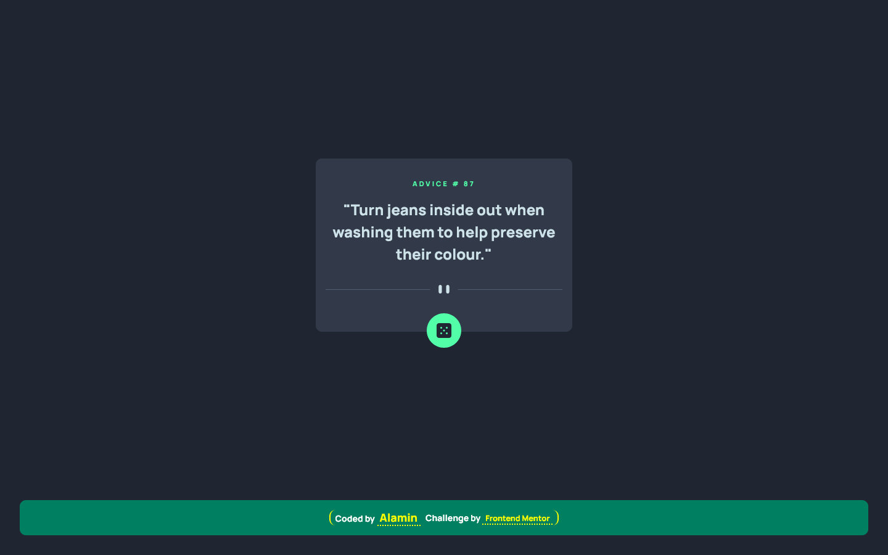

<h1 align="center">Advice generator app</h1>
<div align="center">

Challenge from [Frontend Mentor](https://www.frontendmentor.io/challenges)

</div>

<!-- Badges -->
<div align="center">

<!-- Live -->
<a href="https://advice-generator-app-codepapa360.netlify.app/">
    
</a>

<!-- Frontend Mentor -->
<a href="https://www.frontendmentor.io/solutions/advice-generator-app-SHZi_xbXir">
    
</a>
</div>

<div align="center">
<!-- Status -->

<!--  -->


<!-- Liceensee -->

</div>

<hr>

<div align="center">

<p>
This project uses the <a href="https://api.adviceslip.com/">Advice Slip API</a> to generate random quotes of advice. The project is written in `JavaScript` and uses the `fetch()` API to make requests to the <a href="https://api.adviceslip.com/">Advice Slip API</a>. The app features a smooth transition effect when displaying the advice, creating an engaging user experience.
</p>

<!-- Screenshot -->
<a align="center" href="https://advice-generator-app-codepapa360.netlify.app/">



</a>

</div>

## The challenge

Users should be able to:

- View the optimal layout for the app depending on their device's screen size
- See hover states for all interactive elements on the page
- Generate a new piece of advice by clicking the dice icon

## Built with

- Semantic HTML5 markup
- Mobile-first workflow
- CSS custom properties
- JavaScript
- NPM
- [Webpack - a module bundler](https://webpack.js.org/)
- [Advice Slip API](https://api.adviceslip.com/)

## What I Learned

In the process of developing the Advice Generator App, I expanded my skills and knowledge in various aspects of web development. Working with the Advice Slip API allowed me to gain hands-on experience with integrating third-party APIs into my projects. I deepened my understanding of `asynchronous` JavaScript and utilized the `fetch()` API to efficiently retrieve data from the API. Overall, this project provided an opportunity to sharpen my `JavaScript` skills, API integration capabilities, and UI design techniques, further advancing my expertise in web development.

## Installation

- Clone this repo:

```sh
git clone https://github.com/CodePapa360/Advice-generator-app.git
```

- Install dependencies:

```sh
npm install
```

- Build command:

```sh
npm run build
```

- Live server:

```sh
npm start
```

## Author

<b>👤 Alamin</b>

- Twitter - [@CodePapa360](https://www.twitter.com/CodePapa360)
- LinkedIn - [@CodePapa360](https://www.linkedin.com/in/codepapa360)
- Frontend Mentor - [@CodePapa360](https://www.frontendmentor.io/profile/CodePapa360)
- Github: [@CodePapa360](https://github.com/codepapa360)

Feel free to contact me with any questions or feedback!

## Show your support

Give a ⭐️ if you liked this project!

## Acknowledgments

Special thanks to Frontend Mentor for providing such an amazing platform to practice and improve my frontend skills.

## License

This project is licensed under the [MIT](https://github.com/CodePapa360/Advice-generator-app/blob/main/LICENSE.md) license, which means you can use, modify, and distribute the code as you wish. If you have any questions or feedback, feel free to reach out. Thank you for considering my code!
